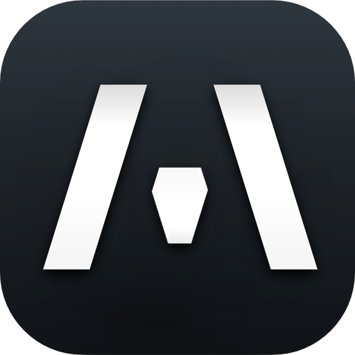
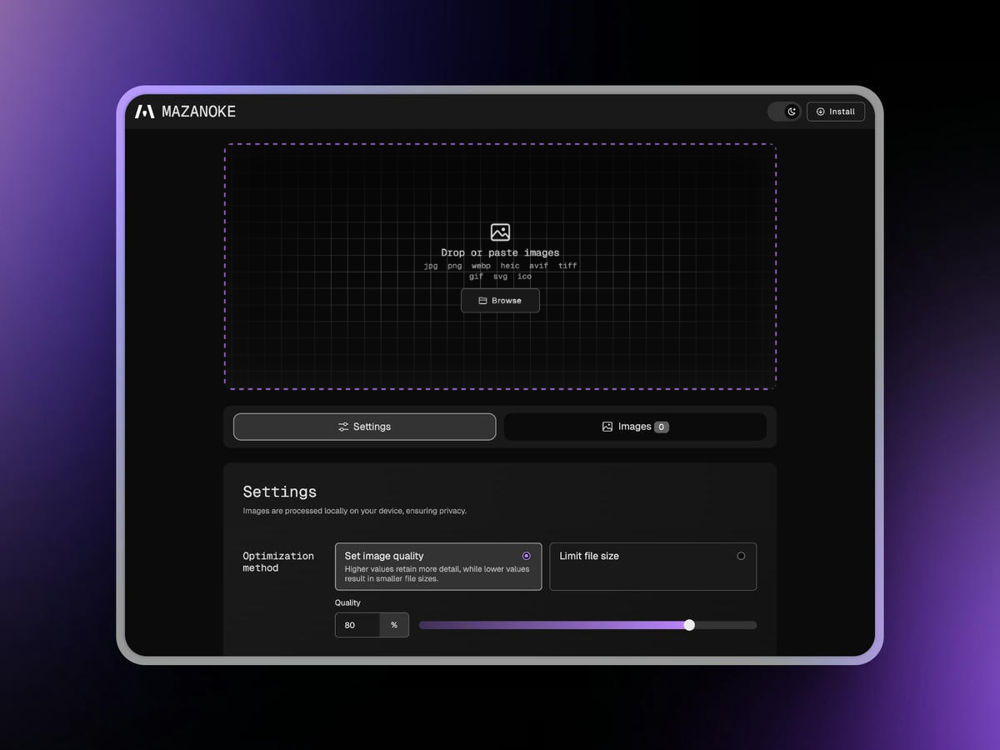
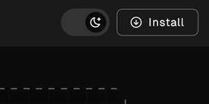
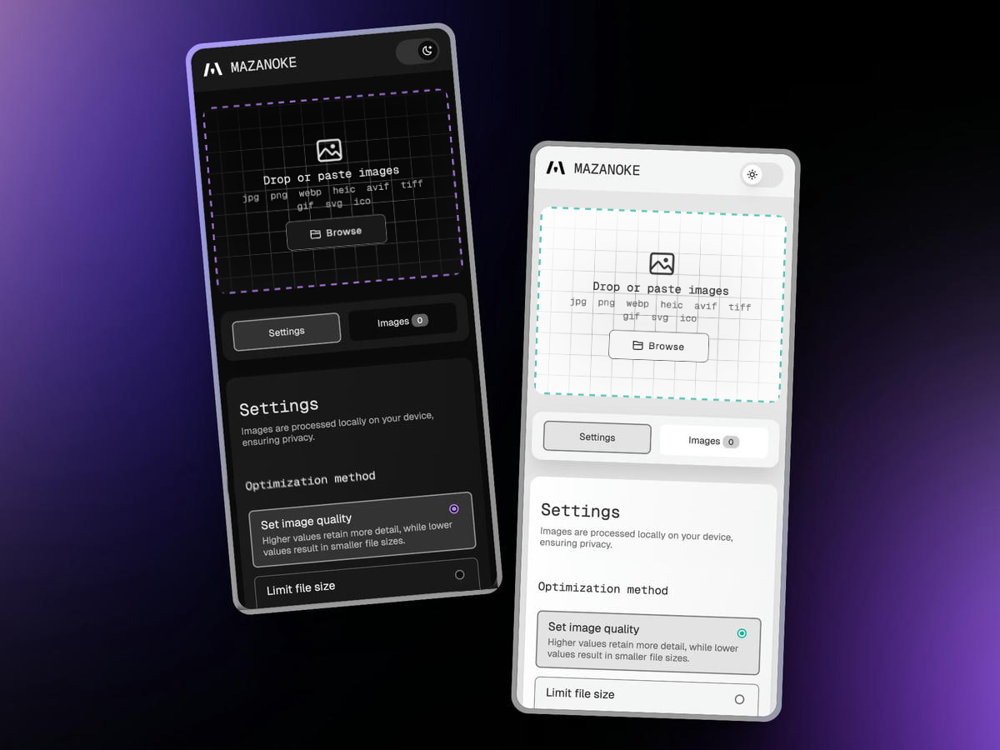
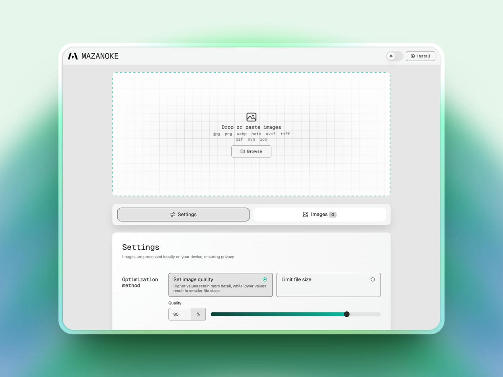
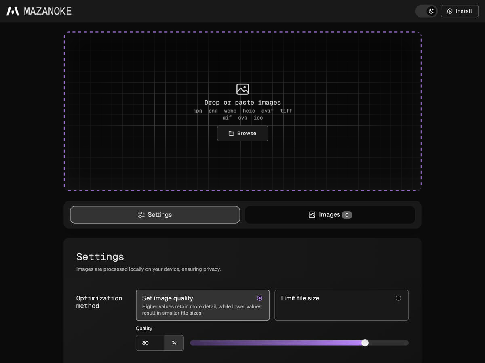
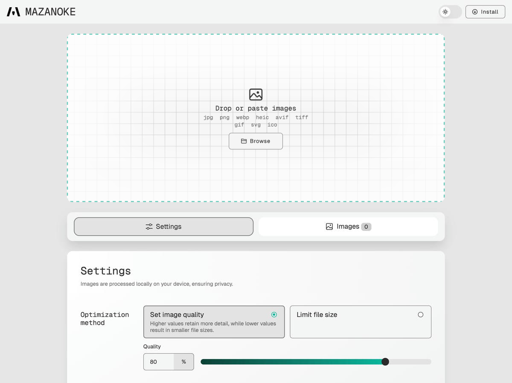
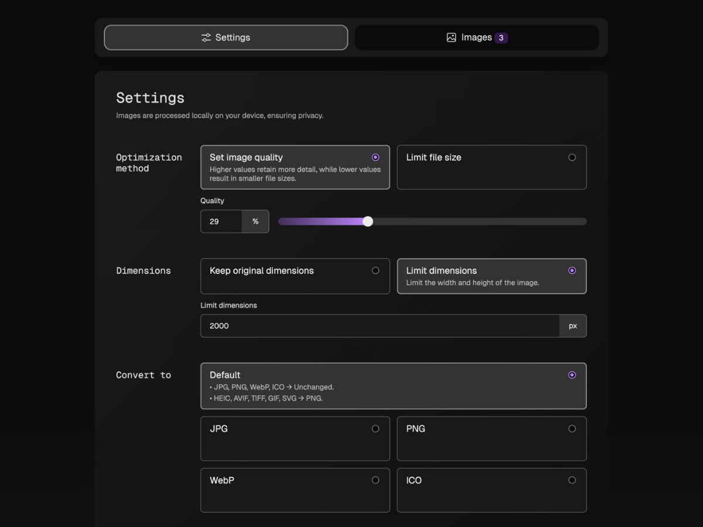
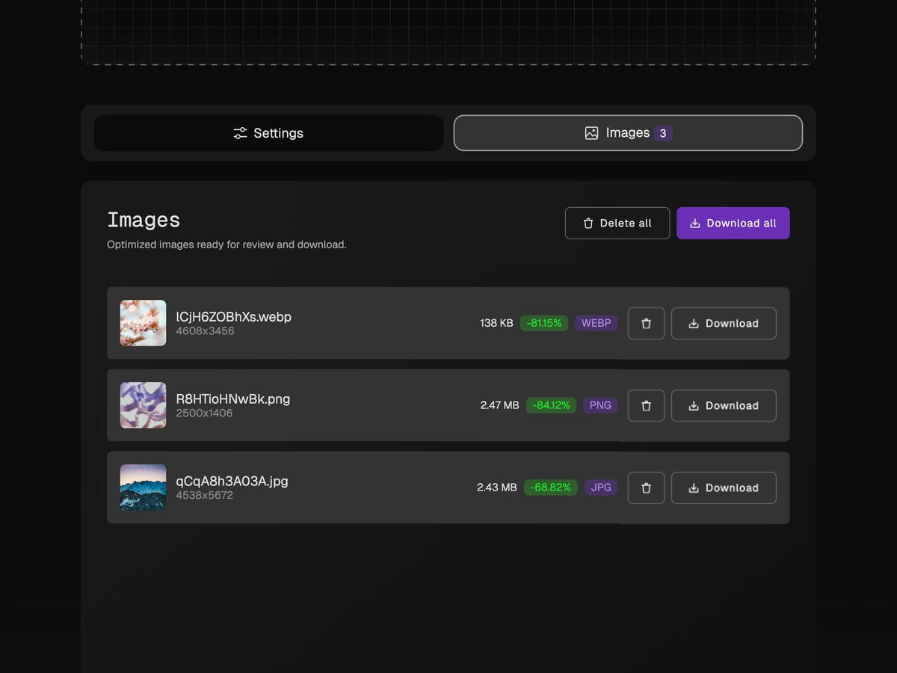

<h1 align="center">
  

LS IMG Compress

</h1>

<h2 align="center"> A self-hosted local image optimizer that runs in your browser.</h2>

<center>
   
</center>

## About

LS IMG Compress is a simple image optimizer that runs in your browser, works offline, and keeps your images private without ever leaving your device.

Created for everyday people and designed to be shared with family and friends, it serves as an alternative to questionable "free" online tools.

## Table of Content

- [Features](#features)
- [Install](#install)
- [Screenshots](#screenshots)
- [Attributions](#attributions)

## Features

- 🖼️ **Optimize Images in Your Browser**
  - Adjust image quality
  - Set target file size
  - Set max width/height
  - Paste images from clipboard
  - Convert between and to `JPG`, `PNG`, `WebP`, `ICO`
  - Convert from `HEIC`, `AVIF`, `TIFF`, `GIF`, `SVG`
- 🔒 **Privacy-Focused**
  - Works offline
  - On-device image processing
  - Removes EXIF data (location, date, etc.)
  - No tracking
  - Installable web app ([learn more](./docs/install-web-app.md))

## Install

### Docker

1. Using [Docker Compose](https://docs.docker.com/compose/):
   ```yaml
   services:
     ls-img-compress:
        container_name: ls-img-compress
        image: ghcr.io/girishlade111/Image-Compressor:latest
       ports:
         - "3474:80"
       restart: unless-stopped
   ```
   Available environmental variables: [Configuration](./docs/configuration.md)
1. Access the app at `http://localhost:3474`

### Local

1. Download the [latest source code release](https://github.com/girishlade111/Image-Compressor/releases).
1. Open the `index.html` file to launch the app in your browser.

### Web App

1. Visit the app URL, or self-host for even stronger privacy.
1. Click the "Install" button in the top-right.
   - If the button isn’t available, you can still install it manually in a few simple clicks. ([See how](./docs/install-web-app.md#manual-install))
1. A shortcut to LS IMG Compress will be added to your device and can even be used offline.



## Screenshots

<center>
   
</center>

<center>
   
</center>

|                                                                                                                           |                                                                                                                                |
| :-----------------------------------------------------------------------------------------------------------------------: | :----------------------------------------------------------------------------------------------------------------------------: |
|       Dark mode<br>       |        Light mode<br>        |
| Settings<br> | Download images<br> |

## Attributions

- [Browser Image Compression](https://github.com/Donaldcwl/browser-image-compression)
- [heic-to](https://github.com/hoppergee/heic-to), [libheif](https://github.com/strukturag/libheif), [libde265](https://github.com/strukturag/libde265)
- [JSZip](https://github.com/Stuk/jszip)

[View full list and details](./docs/ATTRIBUTIONS.md)

## License

[GNU General Public License v3.0](https://github.com/girishlade111/Image-Compressor/blob/main/README.md)
